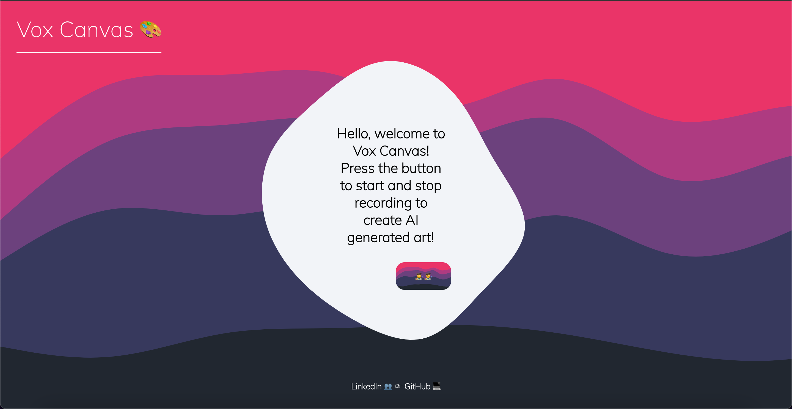
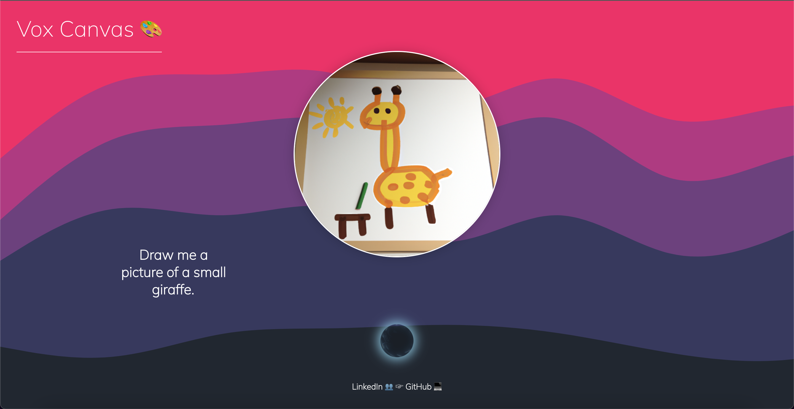

# VoxCanvas App

This is a React app that allows users to transcribe audio recordings using the OpenAI Whisper API and generate AI art based on the transcription using the Dale2Image Generation API. The recording functionality is tuned for desktop browsers, not mobile browsers. Updates will be posted here. Try it out! https://vox-canvas.vercel.app/ 🎨





## Prerequisites

Before running the app, make sure you have the following:

- Node.js (v14 or later)
- npm (Node Package Manager)
- Axios package
- React Typewriter Package

## Getting Started
Clone the repository:
```bash
git clone https://github.com/paschalc24/vox-canvas/
```
## Install dependencies:
```bash
npm install
```
## Set up API access:
Sign up for an OpenAI account if you don't have one.
Obtain an API key and add your API keys to the .env file in the project root:

Copy code
```
REACT_APP_API_KEY=your-api-key
```

Start the development server:
```bash
npm start
```
Open your browser and visit http://localhost:3000 to view the app.

## Usage
- Click the "Recording" button to begin audio recording.
- Speak into your microphone to record your audio.
- Click the "Recording" button to stop the recording.
- The app will transcribe the audio using the Whisper API and generate AI art based on the transcription using the Dale2Image Generation API. The AI-generated art will be displayed on the screen along with the transcription text.

## Technologies Used
- React
- Axios (for making API requests)
- OpenAI Whisper API
- OpenAI Dale2Image Generation API

## Contributing
Contributions are welcome! If you have any suggestions or improvements, feel free to submit a pull request.

## License
This project is licensed under the MIT License.
